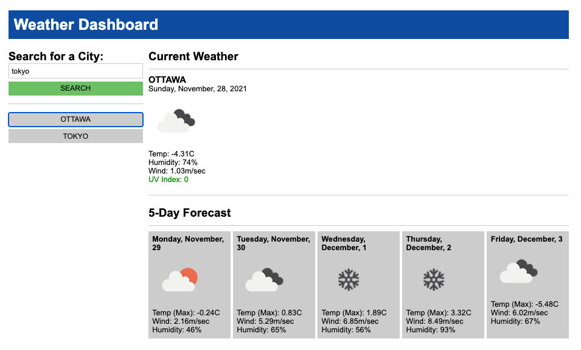

# Module 6 Challenge: Weather Dashboard

This browser-based, JS-powered weather dashboard performs the following functions:
- Display the current weather of a city that is entered in the search bar
- Display the weather forecast for the next five days for the said city
- If you made a valid search for a city, the search is saved in the sidebar as a button. 

Application URL: https://dyoshizawa079.github.io/challenge6-weather-dashboard/